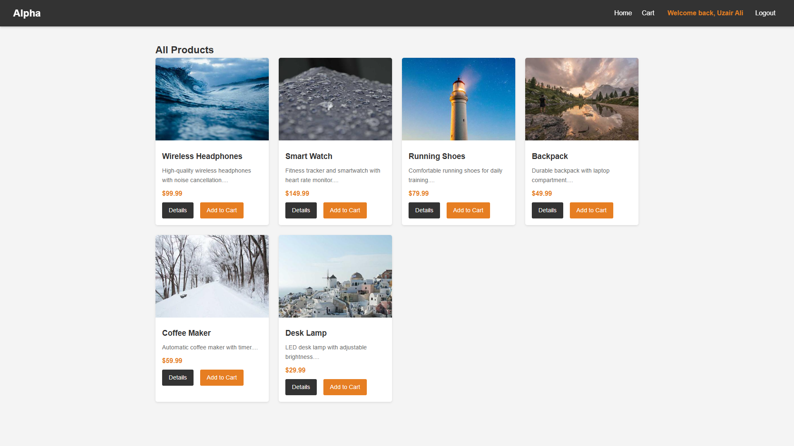
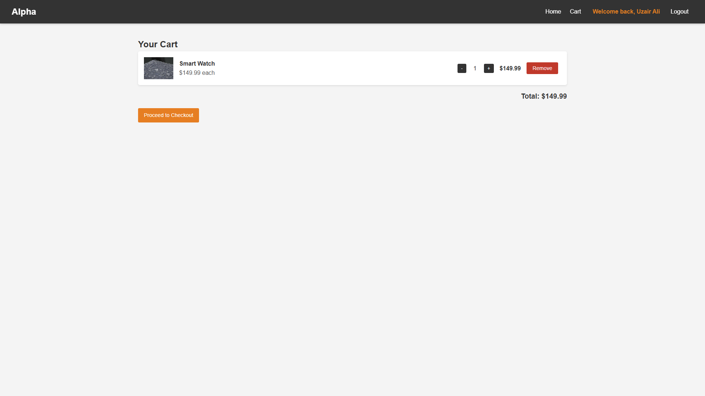
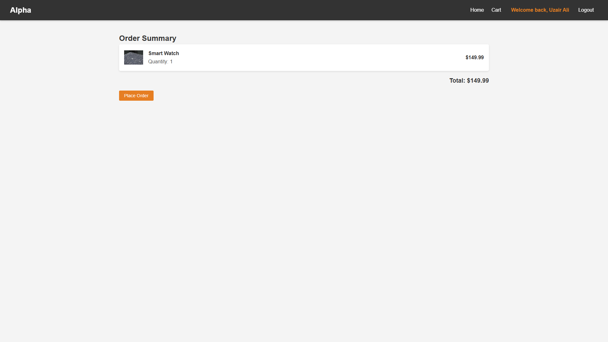
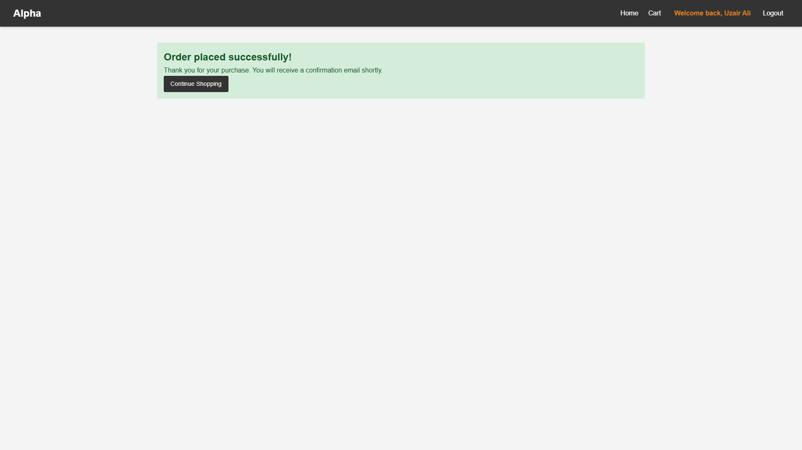
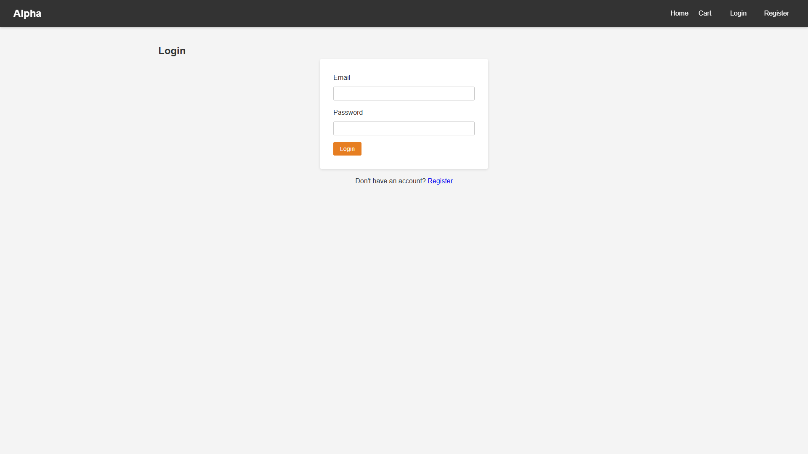
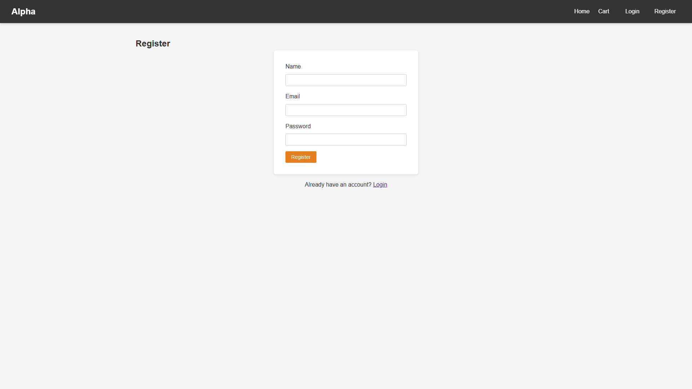

<div align="center">

# 🛒 CodeAlpha E-Commerce Website

### Full-Stack E-Commerce Platform

A modern, responsive e-commerce website built with **HTML, CSS, JavaScript, GSAP, Node.js, Express.js, and MongoDB** as part of my **Code Alpha Full Stack Development Internship**.

<br />

[](https://github.com/uzair0x7/CodeAlpha-Projects)
[](https://nodejs.org/)
[](https://expressjs.com/)
[](https://www.mongodb.com/)
[](https://developer.mozilla.org/en-US/docs/Web/JavaScript)
[](https://gsap.com/)

<br />

[](https://github.com/uzair0x7/CodeAlpha-Projects)
[](https://www.linkedin.com/in/uzairdev1/)

</div>

---

## Overview

**CodeAlpha E-Commerce Website** is a full-stack e-commerce application developed during my **Code Alpha Full Stack Development Internship**.

The project demonstrates the development of a complete online shopping experience, combining a responsive frontend with a Node.js/Express.js backend and MongoDB database.

I also integrated **GSAP (GreenSock Animation Platform)** into the frontend as part of my ongoing learning and practice with web animations. The animations are intentionally simple and focus on improving the overall feel of the interface without overwhelming the user experience.

The application covers essential e-commerce functionality including:

- User authentication
- Product browsing
- Product details
- Shopping cart management
- Persistent cart storage
- Checkout
- Order creation
- Protected routes
- RESTful APIs
- MongoDB data persistence
- Responsive design
- GSAP-powered UI animations

The project is structured into separate **client** and **server** applications to maintain a clean separation between the frontend and backend.

---

## Features

### Authentication

- User registration
- User login
- JWT-based authentication
- Protected backend routes
- Authentication middleware
- User-specific order access

### Product Management

- Dynamic product listing
- Individual product details
- Product data retrieved through REST APIs
- MongoDB-backed product storage

### Shopping Cart

- Add products to cart
- Remove products from cart
- Increase product quantity
- Decrease product quantity
- Persistent cart using `localStorage`
- Automatic cart state management

### Checkout & Orders

- Checkout workflow
- Order creation
- Order confirmation
- Protected order endpoints
- User-specific order history

### GSAP Animations

GSAP was added as part of my learning process to understand modern JavaScript-based web animations.

The project currently uses GSAP for:

- Page entrance animations
- Product card stagger animations
- Cart item animations
- Checkout item animations
- Navbar entrance animations
- Button hover scaling
- Product image hover scaling
- Add-to-cart button feedback
- Cart badge animations

The animations are kept lightweight and focused on enhancing the existing UI rather than replacing normal CSS interactions.

### Responsive Interface

The frontend is designed to work across:

- Desktop
- Laptop
- Tablet
- Mobile

---

## Tech Stack

| Layer | Technology |
|---|---|
| Frontend | HTML5, CSS3, JavaScript ES6 |
| Animations | GSAP |
| Backend | Node.js, Express.js |
| Database | MongoDB |
| ODM | Mongoose |
| Authentication | JSON Web Tokens |
| Client Storage | localStorage |
| API Architecture | REST |
| Styling | Custom CSS |
| Version Control | Git & GitHub |

---

## Architecture

```text
                    ┌──────────────────────┐
                    │       CLIENT         │
                    │                      │
                    │ HTML5                │
                    │ CSS3                 │
                    │ JavaScript           │
                    │ GSAP                 │
                    └──────────┬───────────┘
                               │
                               │ HTTP / REST API
                               ▼
                    ┌──────────────────────┐
                    │       SERVER         │
                    │                      │
                    │ Node.js              │
                    │ Express.js           │
                    │ REST API             │
                    └──────────┬───────────┘
                               │
                ┌──────────────┼──────────────┐
                │              │              │
                ▼              ▼              ▼
          ┌──────────┐   ┌──────────┐   ┌──────────┐
          │   JWT    │   │ Mongoose │   │ Routes   │
          │   Auth   │   │   ODM    │   │ & APIs   │
          └──────────┘   └────┬─────┘   └──────────┘
                              │
                              ▼
                    ┌──────────────────────┐
                    │       MongoDB        │
                    │                      │
                    │ Users                │
                    │ Products             │
                    │ Orders               │
                    └──────────────────────┘
````

---

## Project Structure

```text
CodeAlpha_Ecommerce-Website/
│
├── client/
│   │
│   ├── public/
│   │   ├── styles/
│   │   │   ├── style.css
│   │   │   └── navbar.css
│   │   │
│   │   └── javascript/
│   │       ├── script.js
│   │       └── gsap.js
│   │
│   └── views/
│       ├── index.html
│       ├── product.html
│       ├── cart.html
│       ├── login.html
│       ├── register.html
│       ├── checkout.html
│       ├── order-confirmation.html
│       └── navbar.html
│
├── server/
│   │
│   ├── config/
│   │   └── db.js
│   │
│   ├── models/
│   │   ├── User.js
│   │   ├── Product.js
│   │   └── Order.js
│   │
│   ├── routes/
│   │   ├── auth.js
│   │   ├── products.js
│   │   └── orders.js
│   │
│   └── middleware/
│       └── authMiddleware.js
│
├── app.js
├── package.json
├── .env
├── .gitignore
└── README.md
```

---

## API Endpoints

### Authentication

| Method | Endpoint             | Description         | Authentication |
| ------ | -------------------- | ------------------- | -------------- |
| `POST` | `/api/auth/register` | Register a new user | No             |
| `POST` | `/api/auth/login`    | Login user          | No             |

### Products

| Method | Endpoint            | Description          | Authentication |
| ------ | ------------------- | -------------------- | -------------- |
| `GET`  | `/api/products`     | Get all products     | No             |
| `GET`  | `/api/products/:id` | Get a single product | No             |

### Orders

| Method | Endpoint      | Description                     | Authentication |
| ------ | ------------- | ------------------------------- | -------------- |
| `POST` | `/api/orders` | Create an order                 | Yes            |
| `GET`  | `/api/orders` | Get authenticated user's orders | Yes            |

---

## Authentication Flow

The application uses **JSON Web Tokens (JWT)** to authenticate users and protect private API endpoints.

```text
User
 │
 ├── Register
 │      │
 │      ▼
 │   MongoDB
 │
 └── Login
        │
        ▼
    JWT Token
        │
        ▼
 Protected Request
        │
        ▼
 Authentication Middleware
        │
       ┌┴┐
       │ │
    Valid Invalid
       │ │
       ▼ ▼
    Access 401
    Granted Unauthorized
```

Protected requests use:

```http
Authorization: Bearer <JWT_TOKEN>
```

---

## Shopping Cart Flow

The shopping cart uses browser `localStorage` for persistence.

```text
Product
   │
   ▼
Add to Cart
   │
   ▼
localStorage
   │
   ▼
Cart
   │
   ├── Increase Quantity
   ├── Decrease Quantity
   └── Remove Product
   │
   ▼
Checkout
   │
   ▼
Create Order
   │
   ▼
Order Confirmation
```

This allows cart data to remain available when the user refreshes or revisits the page.

---

## GSAP Animation Flow

The frontend uses GSAP to add lightweight UI animations.

```text
Page Load
    │
    ├── Container Entrance
    │
    ├── Product Card Stagger
    │
    ├── Navbar Entrance
    │
    └── Cart Badge Entrance

User Interaction
    │
    ├── Button Hover
    ├── Product Image Hover
    └── Add to Cart Feedback
```

The purpose of adding GSAP was also to gain practical experience with:

* `gsap.from()`
* `gsap.to()`
* `gsap.fromTo()`
* `stagger`
* Animation easing
* Transform-based animations
* Event-driven animations

---

## Getting Started

### Prerequisites

Make sure you have the following installed:

* **Node.js 18+**
* **MongoDB** or **MongoDB Atlas**
* **Git**
* A modern web browser

---

### 1. Clone the Repository

```bash
git clone https://github.com/uzair0x7/CodeAlpha-Projects.git
```

Navigate to the project:

```bash
cd CodeAlpha-Projects/CodeAlpha_Ecommerce-Website
```

---

### 2. Install Dependencies

```bash
npm install
```

---

### 3. Configure Environment Variables

Create a `.env` file in the project root:

```env
PORT=5000
MONGO_URI=mongodb://localhost:27017/ecommerce
JWT_SECRET=your_super_secret_key
```

> **Important:** Never commit your real `.env` file or production credentials to GitHub.

---

### 4. Start the Application

For development:

```bash
npm run dev
```

For production:

```bash
npm start
```

The application should be available at:

```text
http://localhost:5000
```

---

## Application Flow

```text
01. Register
       ↓
02. Login
       ↓
03. Browse Products
       ↓
04. View Product
       ↓
05. Add to Cart
       ↓
06. Manage Cart
       ↓
07. Checkout
       ↓
08. Place Order
       ↓
09. Order Confirmation
       ↓
10. View Order History
```

---

## Screenshots

Add application screenshots here to showcase the UI:

```md











```

### Recommended Screenshots

| Screenshot         | Purpose                           |
| ------------------ | --------------------------------- |
| Home Page          | Showcase the overall design       |
| Product Page       | Demonstrate product details       |
| Shopping Cart      | Showcase cart functionality       |
| Checkout           | Demonstrate the checkout workflow |
| Login / Register   | Showcase authentication           |
| Order Confirmation | Demonstrate order processing      |

---

## Security

The backend uses authentication middleware to protect private resources.

The current architecture can be further strengthened for production with:

* HTTP-only authentication cookies
* Password hashing with bcrypt
* Rate limiting
* Request validation
* CORS configuration
* Helmet security headers
* Input sanitization
* Secure production secrets
* Production MongoDB configuration
* Error logging and monitoring

---


## Code Alpha Internship

This project was developed as part of my:

### **Code Alpha — Full Stack Development Internship**

The project focuses on applying full-stack development concepts in a practical environment while also exploring modern frontend animation techniques.

### Internship Focus

```text
Frontend Development
        ↓
Responsive UI
        ↓
GSAP Animation
        ↓
REST API Development
        ↓
Authentication
        ↓
Database Integration
        ↓
E-Commerce Logic
        ↓
Full-Stack Application
```

---

## Learning Outcomes

Through this project, I strengthened my practical understanding of:

* Full-stack application architecture
* Node.js development
* Express.js backend development
* REST API design
* MongoDB database integration
* Mongoose ODM
* JWT authentication
* Protected API routes
* Client-side state management
* Browser localStorage
* Responsive web design
* Git and GitHub workflows
* Backend project organization
* API integration
* Error handling
* Full-stack debugging
* GSAP fundamentals
* JavaScript animation workflows
* Staggered animations
* Hover and interaction animations
* Animation easing and timing

### GSAP Learning

One of the goals of this project was to begin learning **GSAP** and understand how animation can be integrated into a real-world application.

Rather than building animations purely for demonstration, I used GSAP directly inside the e-commerce interface to experiment with:

```text
gsap.from()
    ↓
gsap.to()
    ↓
gsap.fromTo()
    ↓
stagger
    ↓
easing
    ↓
hover interactions
    ↓
UI feedback animations
```

This gave me practical experience using GSAP alongside normal HTML, CSS, and JavaScript.

---

## Development Principles

### Clean Architecture

Keeping frontend, backend, routes, models, middleware, and configuration separated for better maintainability.

### Responsive Design

Building interfaces that provide a consistent experience across desktop, tablet, and mobile devices.

### Modularity

Organizing functionality into separate modules rather than placing application logic into a single file.

### Security

Using authentication middleware and environment variables to protect sensitive functionality and configuration.

### Maintainability

Writing code and structuring the project in a way that makes future features easier to implement.

### Progressive Learning

Using real projects as opportunities to learn new technologies and techniques.

GSAP was introduced into this project specifically to gain practical experience with modern frontend animation.

---

## Repository

This project is part of my Code Alpha internship repository:

**GitHub:**

[https://github.com/uzair0x7/CodeAlpha-Projects](https://github.com/uzair0x7/CodeAlpha-Projects)

---

## Developer

<div align="center">

# Uzair Ali

### Full Stack Developer

Building modern web applications with a focus on **clean architecture, performance, security, and polished user experiences.**

<br />

[](https://github.com/uzair0x7)

[](https://www.linkedin.com/in/uzairdev1/)

</div>

---

## License

This project is licensed under the **MIT License**.

See the `LICENSE` file for details.

---

<div align="center">

### Built with Node.js · Express.js · MongoDB · JavaScript · GSAP

**Code Alpha — Full Stack Development Internship**

<br />

⭐ If you found this project useful or interesting, consider starring the repository.

</div>
```
